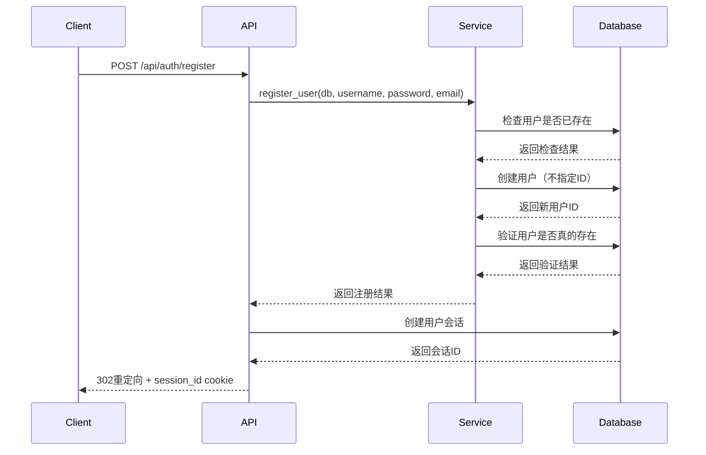

# LandPPT 注册问题完整解决方案

## 问题总结

**现象**：调用 `/api/auth/register` 接口返回302（注册成功），但数据库中没有新用户。

**根本原因**：
1. 数据库表结构问题：`users.id` 字段不是主键，不支持自增
2. 原代码手动ID生成逻辑在并发情况下容易冲突
3. 缺少事务验证机制

## 完整修复方案

### 第一阶段：代码层修复（已完成）

#### 1. 修复注册服务逻辑 [`src/landppt/auth/auth_service.py`](src/landppt/auth/auth_service.py)
- ✅ 移除手动ID设置，让数据库处理ID生成
- ✅ 添加数据库连接验证
- ✅ 添加用户创建后的双重验证
- ✅ 增强错误处理和日志记录

#### 2. 增强路由层验证 [`src/landppt/auth/routes.py`](src/landppt/auth/routes.py)
- ✅ 注册成功后验证用户是否真的存在
- ✅ 会话创建异常保护
- ✅ 详细的操作日志

### 第二阶段：数据库结构优化（推荐执行）

#### 3. 运行表结构检查工具
```bash
python3 check_and_fix_table_structure.py
```

这个工具会：
- 检查当前表结构问题
- 测试自增功能支持
- 生成修复SQL语句
- 提供详细的修复建议

#### 4. 运行SQLAlchemy模型检查
```bash
python3 check_sqlalchemy_model.py
```

这个工具会：
- 验证模型定义与数据库结构的兼容性
- 检查自增支持情况
- 生成模型修复建议

### 第三阶段：数据库表结构修复

#### 5. 执行数据库修复（关键步骤）

根据检查工具生成的SQL文件，执行以下操作：

**备份数据**：
```sql
-- 创建数据备份
CREATE TABLE users_backup AS SELECT * FROM users;
```

**修复表结构**：
```sql
-- 删除原表
DROP TABLE users;

-- 创建新表（带自增主键）
CREATE TABLE users (
    id INTEGER PRIMARY KEY AUTOINCREMENT,
    username VARCHAR(50) UNIQUE NOT NULL,
    password_hash VARCHAR(128) NOT NULL,
    email VARCHAR(100) UNIQUE,
    is_active BOOLEAN DEFAULT 1,
    is_admin BOOLEAN DEFAULT 0,
    created_at FLOAT,
    last_login FLOAT
);

-- 恢复数据（ID重新生成）
INSERT INTO users (username, password_hash, email, is_active, is_admin, created_at, last_login)
SELECT username, password_hash, email, is_active, is_admin, created_at, last_login FROM users_backup;

-- 清理备份
DROP TABLE users_backup;

-- 验证结果
SELECT COUNT(*) as user_count FROM users;
SELECT MAX(id) as max_id FROM users;
```

#### 6. 验证修复效果

**运行测试脚本**：
```bash
python3 verify_register_fix.py
```

**测试注册功能**：
```bash
python3 test_register_fix.py
```

## 修复后的注册流程



## 关键改进点

### 1. 数据库层面
- **自增主键**：消除ID冲突问题
- **唯一约束**：确保用户名和邮箱的唯一性
- **事务安全**：原子性操作保证数据一致性

### 2. 代码层面
- **并发安全**：移除手动ID生成逻辑
- **双重验证**：注册后立即验证用户存在
- **异常处理**：完善的错误处理和回滚机制
- **日志增强**：详细的操作日志便于调试

### 3. 工具支持
- **结构检查**：自动检测表结构问题
- **兼容性验证**：模型与数据库结构对比
- **修复建议**：生成具体的修复SQL和操作步骤

## 预防措施

1. **数据库设计规范**：新表必须包含自增主键
2. **代码审查**：避免手动ID生成逻辑
3. **自动化测试**：注册功能的并发测试
4. **监控告警**：注册失败率监控

## 测试验证

执行所有测试脚本确保修复效果：

```bash
# 1. 检查数据库结构
python3 check_and_fix_table_structure.py

# 2. 验证模型兼容性
python3 check_sqlalchemy_model.py

# 3. 测试注册核心逻辑
python3 verify_register_fix.py

# 4. 完整功能测试（需要启动服务）
python3 test_register_fix.py
```

## 总结

这个解决方案从代码层和数据库层两个维度彻底解决了注册问题：

1. **立即生效**：代码修复可以立即部署，解决大部分注册冲突
2. **根本解决**：数据库结构修复消除ID生成冲突的根源
3. **工具支持**：提供完整的检查和验证工具
4. **预防为主**：建立规范和监控机制防止问题复发

修复后，注册功能将具备高并发安全性和数据一致性保证。